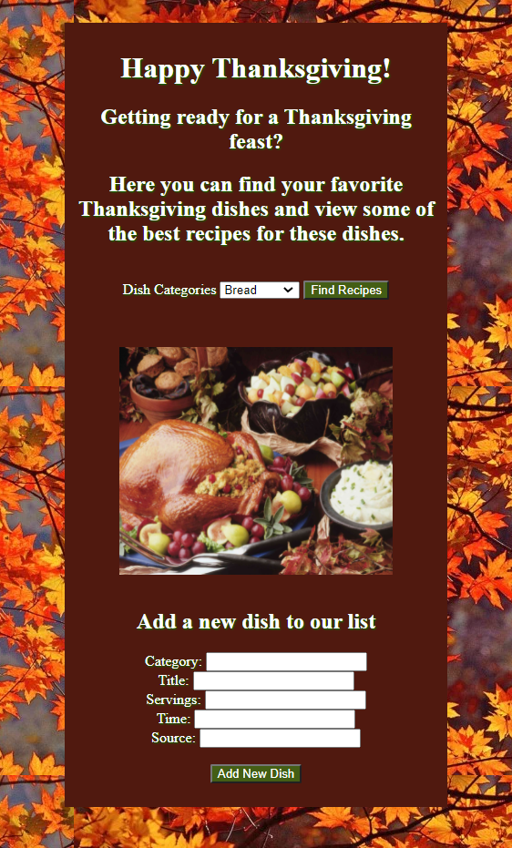

# Overview

I have never used Django before, and I wanted to create this web app to learn Django and see what I could accomplish with it. I wanted to challenge myself by trying something I was completely unfamiliar with.

I used Replit's web app template so I could get started quickly. This made it simple to simply run the server after making migrations. With the provided url, I can open my site. The home page of my site gives a quick overview of the purpose of the site. There I have options of Thanksgiving dish categories to choose from. From the dropdown menu selection, the user will be taken to a recipe page. The homepage also includes a form for submitting new recipes. On the recipe page, the selected category will be displayed, and all dishes in that category will be listed. The list will include details of the meal and a link to the full recipe.

My purpse for writing this software, other than to learn Django, was make the process of Thanksgiving meal preparation easier. With my site a user can find Thanksgiving recipes in one location rather than needing to search for each recipe individually. It provides the user with an organized recipe book specifically for Thanksgiving dishes.

[Thanksgiving Recipes App Demo Video](https://youtu.be/GD6GHE4abMU)

# Web Pages

The home page currently has a form for submitting recipes. When the submit is clicked the user inputs will be stored in a model called Dish, which is kept in the sqlite database. The home page also has a dropdown menu which is dynamically created based on the categories found in the database of recipes. If a recipe is submitted on the page, the dropdown will update automatically to include the new category (if it didn't already exist. When a category is selected and the button is clicked, the recipe page is called and the category chosen is posted to the next page.

The recipe page is called from the home page, and provided with a category. The recipe page displays the category and a table of all recipes under that category. The table provides details of the recipes, and a link which takes the user to the page containing the ingredients and full recipe. These page links are created from the url sources provided when the recipe is entered on the home page.

# Development Environment

* Replit
* Python
* Django
* HTML
* CSS

# Useful Websites

* [WikiHow](https://www.wikihow.com/)
* [CSEstack](https://www.csestack.org/django-order-by/#:~:text=Django%20has%20order_by%20method%20to%20sort%20the%20queryset,name%2C%20mobile%20or%20name%29%20to%20sort%20the%20queryset.)
* [Tutorials Point](https://www.tutorialspoint.com/django/index.htm)
* [Django Documentation](https://docs.djangoproject.com/en/3.0/contents/)

# Future Work

* I would like to add the recipes and ingredients to the database.
* I would like to have a featured recipe displaying for each category, with other options listed below. When another recipe is selected, it will replace the featured recipe.
* I would like to store the recipes into Firebase rather than locally.
* I would like to have a feature where a user can suggest a recipe, which could be reviewed and added to Firebase upon approval.
* I would like to publish the site when finished so others can use it.

# Images

